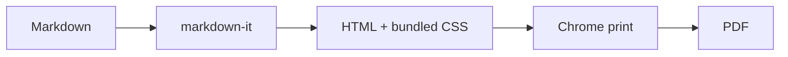
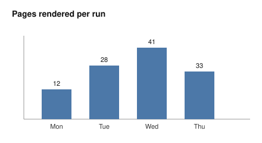

# Sample Document

A short demo that exercises everything the renderer handles. Render it with:

```bash
node scripts/md2pdf.mjs examples/sample.md
```

and a `sample.pdf` appears next to this file.

## Text formatting

Regular text with **bold**, *italic*, `inline code`, and a [link](https://www.onsenapp.com).

> Block quotes render with the extension's left rule and grey text.

## A table

| Feature        | Supported | Notes                                  |
| -------------- | :-------: | -------------------------------------- |
| Headings       |     ✓     | With anchor ids for internal links     |
| Syntax code    |     ✓     | via `highlight.js`                     |
| Mermaid        |     ✓     | fenced ```` ```mermaid ```` blocks     |
| Embedded SVG   |     ✓     | resolved relative to the Markdown file |

## Syntax highlighting

```js
export function greet(name) {
  const who = name?.trim() || "world";
  return `Hello, ${who}!`;
}
```

## Task list

- [x] Parse Markdown with `markdown-it`
- [x] Render Mermaid diagrams
- [x] Embed relative images and charts
- [ ] Your next document

## Mermaid diagram



## Embedded chart

An SVG kept alongside the document in `content/`, referenced by a relative path, is
embedded into the PDF:


